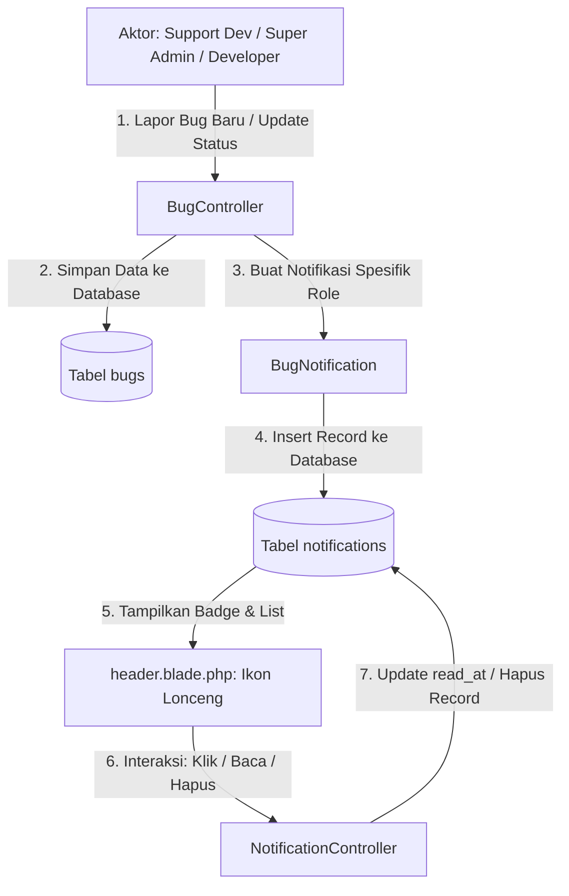

# QATrack - Sistem Manajemen Bug & Notifikasi Multi-Role

QATrack adalah platform pelacakan dan manajemen bug enterprise yang responsif dan berjalan secara real-time. Aplikasi ini dilengkapi dengan autentikasi multi-role, dashboard analitik terpadu, grafik distribusi prioritas, lini masa komentar, pengelolaan user admin (CRUD), serta **sistem notifikasi lonceng interaktif yang terhubung ke seluruh role pengguna**.

---

## 👥 Akun Login & Hak Akses

Semua akun default menggunakan kata sandi: **`pisangkeju`**

| Peran (Role) | Nama / Username | Email | Deskripsi / Hak Akses |
| :--- | :--- | :--- | :--- |
| **Super Admin** | `masteryoda` | `yoda@jedi.com` | Akses penuh sistem: Pengelolaan akun pengguna (CRUD), dasbor statistik global, menugaskan ulang bug, serta memantau seluruh aktivitas tiket. |
| **Support Dev (QA)** | `obiwan` | `obiwan@jedi.com` | Melaporkan bug baru, melihat dasbor statistik khusus bug buatannya sendiri, menerima pembaruan tiket, dan melakukan pengujian ulang (*retest*) atau menutup bug. |
| **Developer** | `anakin` | `anakin@jedi.com` | Melihat bug yang ditugaskan kepadanya, menerima notifikasi tiket baru / darurat (P1), serta memperbarui status pengerjaan (*In Progress* -> *Fixed*). |

---

## 🔄 Inti Alur Sistem (System Core Workflow)



### 1. Alur Pelaporan Bug Baru (*Bug Creation Flow*)
1. Pengguna (**Support Dev** atau **Super Admin**) mengisi form di `bugs-create.blade.php`.
2. Request `POST /bugs` diproses oleh method `BugController@store`.
3. Setelah data bug tersimpan ke database, sistem secara otomatis mengeksekusi pengiriman notifikasi:
   - **Super Admin** menerima notifikasi: *"Bug Baru Dilaporkan"* beserta info pelapor dan prioritasnya.
   - **Developer Ditugaskan** (jika dipilih) menerima notifikasi penugasan: *"Penugasan Bug Baru"*.
   - Jika prioritas **P1 (Kritis)**, notifikasi alert darurat otomatis dikirim ke **seluruh Developer**.

### 2. Alur Pembaruan Status & Penugasan (*Status & Assignment Flow*)
1. Pengguna (**Developer**, **Support Dev**, atau **Super Admin**) mengubah status atau assignee tiket di `bugs-show.blade.php`.
2. Request `PATCH /bugs/{bug}/status` diproses oleh method `BugController@updateStatus`.
3. Sistem mendeteksi jenis perubahan:
   - **Support Dev (Pelapor)** menerima notifikasi bahwa tiket yang ia laporkan sedang diproses (*In Progress*) atau telah selesai (*Fixed*).
   - **Developer** menerima notifikasi jika ada tiket baru dialihkan ke namanya atau statusnya diubah oleh tim lain.
   - **Super Admin** menerima log aktivitas pembaruan tiket.

### 3. Alur Interaksi & Tampilan Notifikasi di Header (*UI Notification Flow*)
1. Setiap halaman aplikasi memuat komponen `header.blade.php`.
2. Blade secara server-side menghitung notifikasi belum dibaca (`unread_count`):
   - Jika `unread_count > 0`, dot merah dengan animasi pulse (`animate-ping`) muncul pada ikon lonceng.
   - Jika `unread_count == 0`, dot merah otomatis disembunyikan.
3. Saat ikon lonceng diklik, dropdown muncul menampilkan:
   - Pill badge jumlah notifikasi baru (`X Baru`).
   - Tab filter: **Semua** (*All*) dan **Belum Dibaca** (*Unread*).
   - Tombol aksi massal: **Tandai dibaca** (*Mark all as read*) dan **Hapus** (*Clear all*).
4. **Navigasi Langsung**: Saat item notifikasi diklik, skrip otomatis menandai notifikasi tersebut sebagai terbaca via AJAX `POST /notifications/{id}/read` lalu mengarahkan browser langsung ke halaman detail bug terkait (`/bugs/{id}`).
5. **Background Polling**: Setiap 30 detik, JavaScript di latar belakang memanggil `GET /notifications` untuk memperbarui badge notifikasi secara real-time tanpa me-reload halaman.

---

## 📂 Penjelasan Inti Fungsi Kode per File

Berikut adalah rincian file-file yang digunakan dalam sistem QATrack beserta inti fungsi kodenya:

### 1. Routing (`routes/`)
- **`routes/web.php`**
  - Mendaftarkan endpoint web untuk Dashboard, Tiket Bug, Manajemen User, Laporan, Pengaturan, serta rute Notifikasi.
  - Membungkus endpoint ke dalam middleware `auth` dan menerapkan pembatasan hak akses berbasis role.
  - Endpoint notifikasi yang digunakan:
    - `GET /notifications` -> `NotificationController@index` (Mengambil list notifikasi & unread count).
    - `POST /notifications/{id}/read` -> `NotificationController@markAsRead` (Menandai 1 notifikasi dibaca).
    - `POST /notifications/read-all` -> `NotificationController@markAllAsRead` (Menandai semua notifikasi dibaca).
    - `DELETE /notifications/{id}` -> `NotificationController@destroy` (Menghapus 1 notifikasi).
    - `DELETE /notifications` -> `NotificationController@clearAll` (Mengosongkan semua notifikasi).

---

### 2. Controllers (`app/Http/Controllers/`)
- **`app/Http/Controllers/NotificationController.php`**
  - Mengelola seluruh operasi data notifikasi untuk pengguna yang sedang login.
  - `index()`: Mengambil relasi `$user->notifications()` dengan opsi filter (`all` / `unread`), memformat data (ikon, label waktu relatif, URL target), dan menghitung jumlah unread.
  - `markAsRead()`: Memanggil `$notification->markAsRead()` untuk mengisi timestamp `read_at`.
  - `markAllAsRead()`: Memanggil `$user->unreadNotifications->markAsRead()`.
  - `destroy()` & `clearAll()`: Menghapus record notifikasi dari database.
- **`app/Http/Controllers/BugController.php`**
  - Mengatur logika bisnis bug (CRUD, hak akses role) sekaligus bertindak sebagai **produsen (*dispatcher*) notifikasi**.
  - `index()`: Menampilkan daftar bug yang difilter sesuai role (Support Dev melihat buatannya, Developer melihat tugasnya, Admin melihat semua).
  - `store()`: Menyimpan bug baru, lalu mendistribusikan `BugNotification` ke Super Admin, Developer terkait, dan notifikasi darurat jika P1.
  - `show()`: Menampilkan halaman detail bug beserta histori dan lampiran.
  - `updateStatus()`: Memvalidasi hak perubahan status (Developer dibatasi hanya status *open*, *in_progress*, *fixed*), lalu mengirim notifikasi ke reporter, developer, dan admin.
- **`app/Http/Controllers/UserController.php`**
  - Khusus Super Admin (`authorizeAdmin()`).
  - `store()`: Menyimpan user baru ke database dan mengirimkan `BugNotification` sambutan selamat datang ke user tersebut.

---

### 3. Models (`app/Models/`)
- **`app/Models/User.php`**
  - Representasi entitas pengguna (`super_admin`, `support_dev`, `developer`).
  - Menggunakan trait `Notifiable` bawaan Laravel yang menyediakan relasi bawaan `$user->notifications()`, `$user->unreadNotifications()`, dan method `$user->notify()`.
- **`app/Models/Bug.php`**
  - Representasi tiket bug.
  - Kolom fillable: `title`, `priority`, `status`, `developer`, `description`, `reporter_id`.
  - Relasi `reporter()`: Menghubungkan tiket bug ke User pembuatnya (`belongsTo(User::class, 'reporter_id')`).

---

### 4. Notifications (`app/Notifications/`)
- **`app/Notifications/BugNotification.php`**
  - Kelas notifikasi Laravel berbasis channel database (`via()` mengembalikan `['database']`).
  - Method `toArray()` mengemas data notifikasi ke format JSON terstruktur:
    - `title`: Judul ringkas notifikasi.
    - `message`: Detail pesan aktivitas.
    - `type`: Kategori event (`bug_created`, `status_updated`, `assigned`, `critical`, `system`).
    - `bug_id`: ID tiket terkait.
    - `url`: Rute tautan detail bug (`route('bugs.show', $bugId)`).
    - `icon`: Nama simbol Google Material Symbols (`bug_report`, `sync`, `person_add`, `check_circle`, `warning`).
    - `badge_color`: Kode warna CSS indikator (`error`, `emerald`, `primary`, `secondary`).

---

### 5. Database Migrations & Seeders (`database/`)
- **`database/migrations/2026_09_17_043818_create_notifications_table.php`**
  - Migration pembentuk tabel `notifications` (kolom UUID `id`, `type`, morphs `notifiable_type` & `notifiable_id`, `data` JSON, `read_at`, `timestamps`).
- **`database/seeders/NotificationSeeder.php`**
  - Mengisi sample data notifikasi awal yang realistis dan kontekstual untuk `masteryoda` (Super Admin), `obiwan` (Support Dev), dan `anakin` (Developer).
- **`database/seeders/DatabaseSeeder.php`**
  - Seeder utama yang membuat ketiga akun default dan otomatis memanggil `NotificationSeeder`.

---

### 6. Views & UI Components (`resources/views/`)
- **`resources/views/layouts/header.blade.php`**
  - Komponen header aplikasi tempat **fitur notifikasi lonceng berada**:
    - **Trigger**: Tombol lonceng dengan elemen `#notification-badge` (dot merah animasi pulse).
    - **Dropdown Panel**: Kontainer `#notification-dropdown` berisi header, counter pill unread, tombol aksi massal, tab filter (*Semua* & *Belum Dibaca*), list notifikasi, dan footer tautan cepat.
    - **Client-Side Script**: Vanilla JavaScript untuk toggle dropdown, deteksi klik luar / tombol Esc, AJAX `markAsRead`, AJAX `markAllAsRead`, AJAX `deleteNotification`, navigasi instan saat item diklik, dan background polling setiap 30 detik.
- **`resources/views/layouts/sidebar.blade.php`**
  - Menampilkan menu navigasi aplikasi yang disesuaikan secara kondisional dengan role user yang sedang aktif.
- **`resources/views/bugs-show.blade.php`**
  - Antarmuka detail bug tempat Developer menekan tombol *Start Progress* / *Mark as Fixed*, atau Super Admin/Support mengubah status & penugasan developer.
- **`resources/views/bugs-create.blade.php`**
  - Formulir pelaporan bug baru oleh Support Dev atau Super Admin.
- **`resources/views/bugs.blade.php`**
  - Halaman tabel daftar bug dengan filter status, prioritas, dan penugasan developer.

---

### 7. Pengujian Fitur (`tests/Feature/`)
- **`tests/Feature/NotificationTest.php`**
  - Pengujian otomatis (PHPUnit) yang mencakup:
    - Keamanan: Tamu (unauthenticated) tidak dapat mengakses API notifikasi.
    - Pengambilan data: Pengguna dapat mengambil list notifikasi dan hitungan unread.
    - Interaktivitas: Pengguna dapat menandai notifikasi dibaca (satuan maupun sekaligus).
    - Event Creation: Pembuatan bug memicu notifikasi ke Super Admin dan Developer.
    - Event Update: Perubahan status bug memicu notifikasi ke Reporter bug.

---

## 🚀 Panduan Instalasi & Menjalankan Aplikasi

### 📋 Prasyarat
- **PHP 8.2+** (dengan ekstensi `pdo_sqlite`, `mbstring`, `curl` aktif)
- **Composer**
- **Node.js & NPM**

### 💻 Langkah Pemasangan

1. **Kloning Repositori**
   ```bash
   git clone https://github.com/alvianahmadfebrian/qatrack.git
   cd qatrack
   ```

2. **Pasang Dependensi PHP dan Javascript**
   ```bash
   composer install
   npm install
   ```

3. **Salin File Konfigurasi Environment**
   ```bash
   cp .env.example .env
   ```

4. **Buat Application Key**
   ```bash
   php artisan key:generate
   ```

5. **Buat File Database SQLite**
   ```powershell
   # Windows PowerShell:
   New-Item -ItemType File -Path database/database.sqlite -Force
   ```

6. **Jalankan Migrasi & Seeder Akun + Notifikasi Bawaan**
   ```bash
   php artisan migrate:fresh --seed
   ```

7. **Jalankan Server Lokal**
   ```bash
   php artisan serve
   ```
   Akses aplikasi melalui peramban: `http://localhost:8000`

---

## 🧪 Menjalankan Pengujian Otomatis

Untuk menjalankan seluruh test suite otomatis:
```bash
php artisan test
```
Atau menjalankan test khusus notifikasi:
```bash
php vendor/bin/phpunit tests/Feature/NotificationTest.php
```
